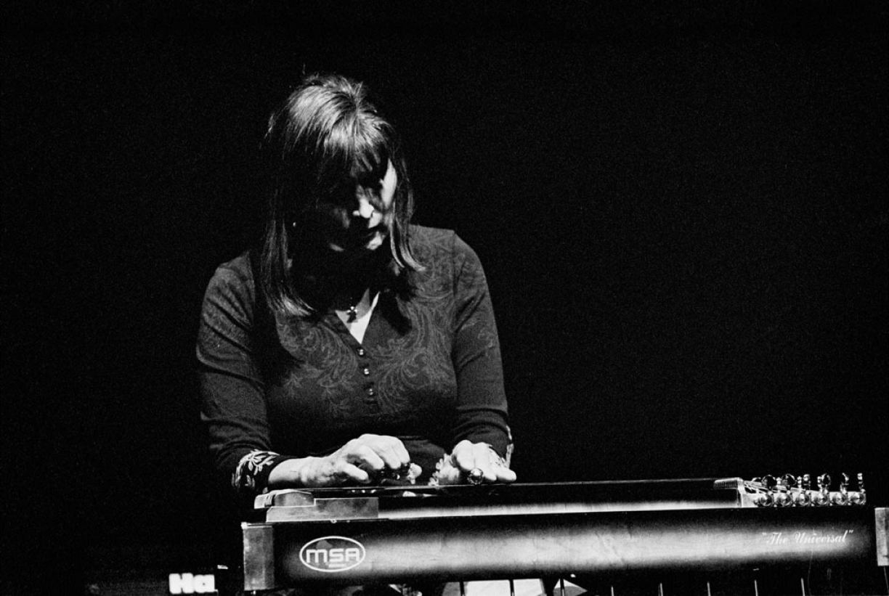
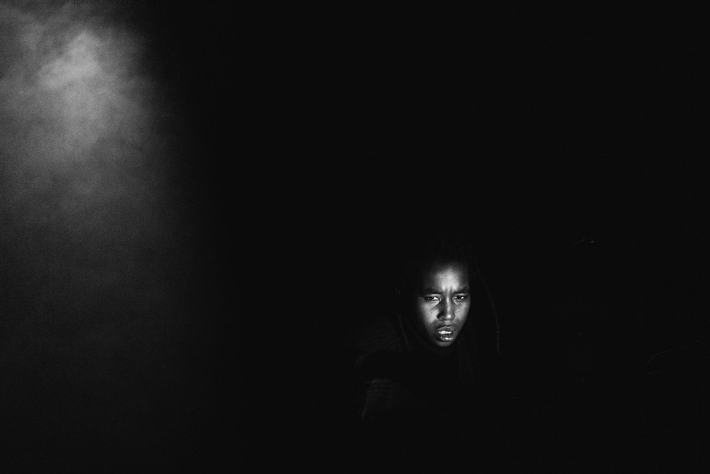
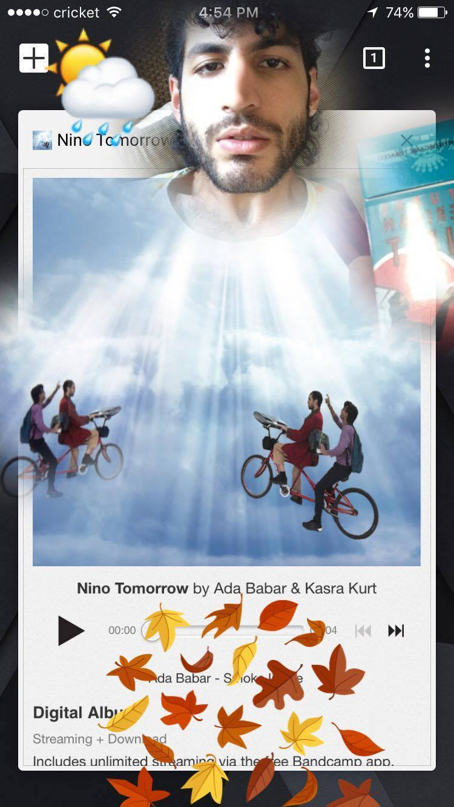
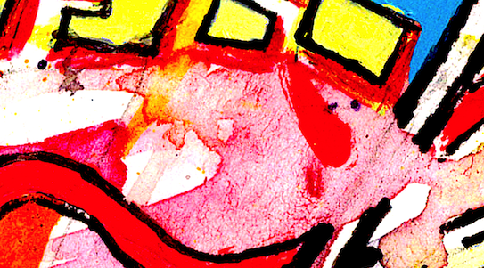

title: People

---

[TOC]

---

####Clément Canonne
is the PI of the project. He is a musicologists and he is awsome.
 
[webpage](http://apm.ircam.fr/membre/CC/)

---

####Louise Goupil 
is a postdoc within the project. She's a cognitive psychologist and she's awsome.
 
[webpage](https://www.ircam.fr/person/louise-goupil/)

---

####Pierre Saint-Germier
is a postdoc within the project. He's a philosopher and he's just okay.
 
[webpage](https://www.ircam.fr/person/pierre-saint-germier

---

####Emmanuelle Majeau-Bettez is a visiting PhD student. She's a musicologist and she's awesome.

   
 
 
   
 
 
   
 
 
   
 
 
   

---

     
  
     

