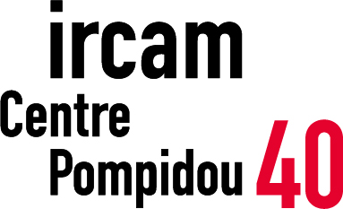
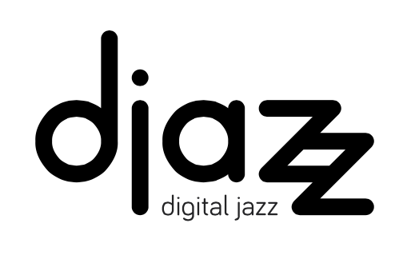

Title: The MICA Project website 
Status: hidden 
save_as: index.html
Date: 2017-10-23 10:20
Tags: improvisation, coordination, music performance, joint action, cognitive science, empirical musicology, collective intentionality
Authors: Guillaume Pellerin, Pierre Saint-Germier
Summary: Official webpage of the MICA project with infos about the research, publications, events, etc.

#### The MICA project -- Musical Improvisation and Collective Action 
 
 
Welcome to the webpage of the MICA project!  
 

---

  

    

